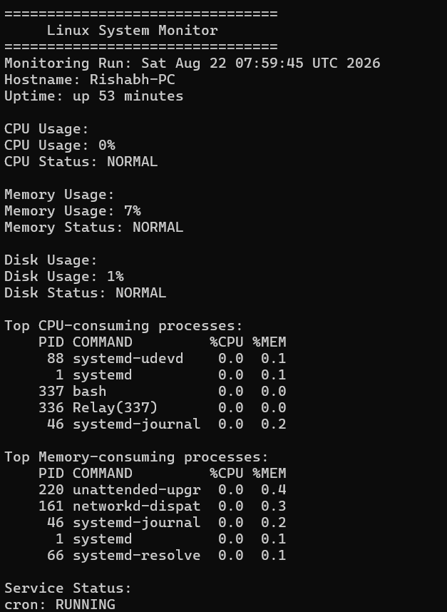
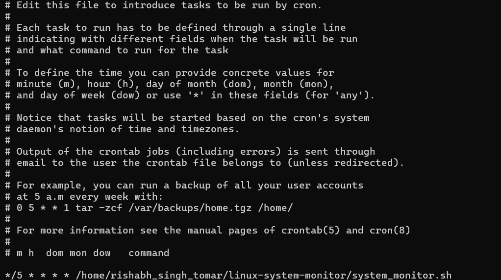
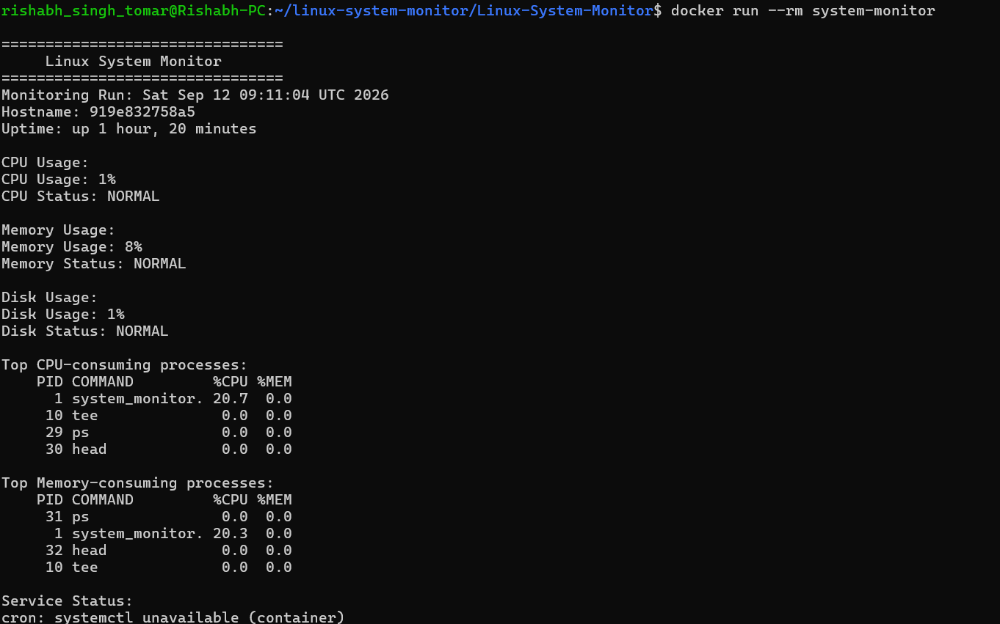

# Linux System Monitoring & Automation

A Bash-based Linux system monitoring and automation tool designed to track system health, identify resource-intensive processes, monitor critical services, and automatically record system metrics using cron. The project is also containerized using Docker.

---

## Overview

This project automates basic Linux system health monitoring using Bash scripting and standard Linux utilities.

The monitoring script checks CPU, memory, and disk utilization against configurable thresholds. It also identifies the processes consuming the most CPU and memory, checks the status of the cron service when systemd is available, and stores monitoring results in a persistent log file.

The script can be automatically executed every 5 minutes using a Linux cron job and can also be run inside a Docker container.

---

## Features

| Feature             | Description                                                     |
| ------------------- | --------------------------------------------------------------- |
| CPU Monitoring      | Tracks current CPU utilization                                  |
| Memory Monitoring   | Tracks system memory utilization                                |
| Disk Monitoring     | Checks root filesystem disk usage                               |
| Threshold Detection | Generates warnings when configured limits are exceeded          |
| Process Monitoring  | Displays top CPU and memory-consuming processes                 |
| Service Monitoring  | Checks the cron service status when systemd is available        |
| Logging             | Stores timestamped monitoring results                           |
| Cron Automation     | Automatically executes monitoring every 5 minutes               |
| Configuration       | Resource thresholds can be modified without changing the script |
| Docker Support      | Runs the monitoring script inside a Docker container            |

---

## Architecture

```text
                    Linux Cron
                        |
                        | Every 5 minutes
                        v
              +---------------------+
              | system_monitor.sh   |
              +---------------------+
                        |
          +-------------+-------------+
          |             |             |
          v             v             v
       CPU Check    Memory Check   Disk Check
          |             |             |
          +-------------+-------------+
                        |
                        v
              Threshold Evaluation
                        |
              +---------+---------+
              |                   |
              v                   v
           NORMAL              WARNING
                                  |
                                  v
                     Top Processes + Service
                            Monitoring
                                  |
                                  v
                         Monitoring Log
                           

                    Docker Support
                         |
                         v
                  +--------------+
                  | Ubuntu 24.04 |
                  |  Container    |
                  +--------------+
                         |
                         v
                 system_monitor.sh
```

---

## Technologies Used

* Linux
* Bash Shell Scripting
* Cron
* systemd / systemctl
* Docker
* Dockerfile
* AWK
* ps
* df
* free
* top
* Git & GitHub

---

## Project Structure

```text
linux-system-monitor/
├── system_monitor.sh
├── config.conf
├── Dockerfile
├── README.md
├── .gitignore
└── logs/
    └── system_monitor.log
```

---

## Configuration

Resource thresholds are stored in `config.conf`.

```bash
CPU_THRESHOLD=80
MEMORY_THRESHOLD=80
DISK_THRESHOLD=80
```

This allows resource limits to be changed without modifying the main monitoring script.

---

## How to Run

### Clone the repository

```bash
git clone https://github.com/Rishabh11341/Linux-System-Monitor.git
cd Linux-System-Monitor
```

### Make the script executable

```bash
chmod +x system_monitor.sh
```

### Run the monitor

```bash
./system_monitor.sh
```

---

## Automated Monitoring with Cron

The monitoring script can be configured to run automatically every 5 minutes using Linux cron.

```cron
*/5 * * * * /home/rishabh_singh_tomar/linux-system-monitor/Linux-System-Monitor/system_monitor.sh
```

Monitoring results are stored in:

```text
logs/system_monitor.log
```

To view the configured cron job:

```bash
crontab -l
```

To view the latest monitoring results:

```bash
tail -n 30 logs/system_monitor.log
```

---

## Run with Docker

The monitoring application can also be executed inside a Docker container.

### Build the Docker image

```bash
docker build -t system-monitor .
```

### Run the monitoring script

```bash
docker run --rm system-monitor
```

The Docker image uses Ubuntu 24.04 as the base environment.

The container runs the monitoring script and displays CPU, memory, disk, process, and service monitoring information.

Since lightweight containers do not normally run systemd, the script detects when `systemctl` is unavailable and handles the container environment accordingly.

---

## Example Output

```text
================================
     Linux System Monitor
================================
Monitoring Run: Sat Sep 12 08:06:41 UTC 2026
Hostname: 6fe16d30285c
Uptime: up 31 minutes

CPU Usage:
CPU Usage: 0%
CPU Status: NORMAL

Memory Usage:
Memory Usage: 8%
Memory Status: NORMAL

Disk Usage:
Disk Usage: 1%
Disk Status: NORMAL

Top CPU-consuming processes:
    PID COMMAND         %CPU %MEM
      1 system_monitor. 14.2  0.0
     10 tee              0.0  0.0
     29 ps               0.0  0.0
     30 head             0.0  0.0

Top Memory-consuming processes:
    PID COMMAND         %CPU %MEM
     31 ps               0.0  0.0
      1 system_monitor. 14.2  0.0
     10 tee              0.0  0.0
     32 head             0.0  0.0

Service Status:
cron: systemctl unavailable (container)
```

---

## Screenshots

### System Monitoring Output



### Automated Cron Execution



### Dockerized Monitoring



---

## Logging

The script displays monitoring results in the terminal while simultaneously recording them in the monitoring log.

Generated log files are excluded from Git using `.gitignore`.

---

## Learning Outcomes

This project provided hands-on experience with:

* Linux system administration
* Bash scripting and automation
* CPU, memory, and disk monitoring
* Linux process monitoring
* Linux service management
* Cron job scheduling
* Log management
* Configuration-driven scripting
* Docker image creation and container execution
* Containerizing a Bash-based Linux monitoring application
* Git version control
* GitHub repository management

---

## Future Improvements

* Email or messaging alerts for critical thresholds
* Monitoring additional Linux services
* Historical metric visualization
* Monitoring multiple filesystems
* Remote server monitoring
* Docker Compose deployment
* Prometheus/Grafana integration

---

## Author

**Rishabh Singh Tomar**

B.Tech ECE | Aspiring DevOps Engineer
